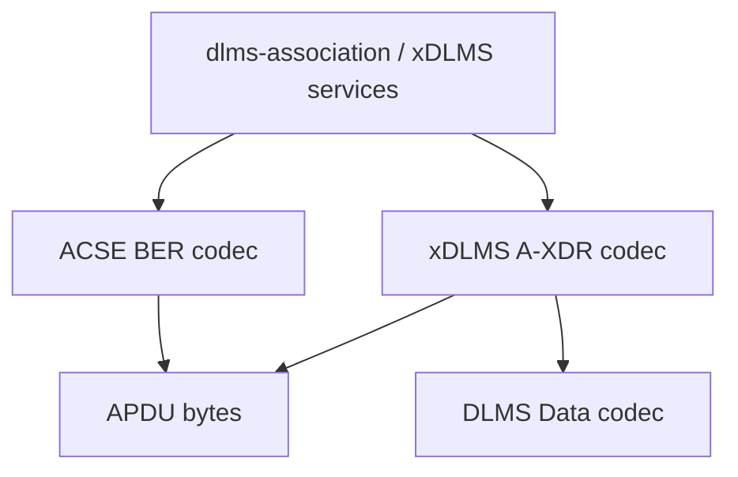
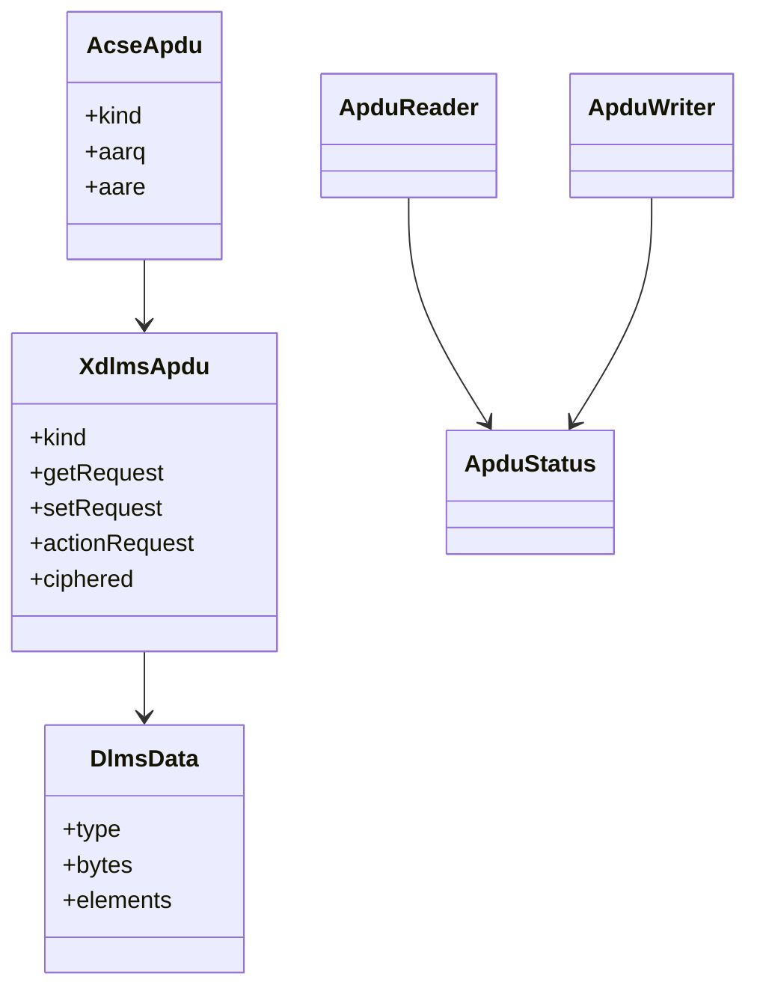

# APDU Architecture

## 1. Scope

`dlms-apdu` implements DLMS/COSEM application-layer APDU codecs:

- ACSE APDUs encoded with BER;
- xDLMS APDUs encoded with A-XDR;
- DLMS Data values used by supported services.

The repository encodes and decodes APDU data structures. It does not implement
association policy, transport profiles, COSEM object storage, or cryptographic
execution.

## 2. In Scope

- BER helper codec.
- A-XDR helper codec.
- ACSE AARQ/AARE/RLRQ/RLRE coverage according to current implementation scope.
- xDLMS InitiateRequest/InitiateResponse.
- LN GET/SET/ACTION request and response structures.
- DLMS Data values required by supported services.
- Opaque ciphered APDU recognition.
- C ABI wrapper.

## 3. Out of Scope

- HDLC, LLC, Wrapper, or transport headers.
- Application Association state machine.
- xDLMS request correlation or retry policy.
- COSEM object model.
- AES-GCM, HLS, key management, or invocation-counter policy.
- SN referencing behavior unless explicitly added in a later phase.

## 4. Dependencies

```text
dlms-apdu
  -> C++ standard library
```

`dlms-apdu` must not depend on lower transport/profile repositories. Lower
layers treat APDU bytes as opaque payload.

## 5. Layer Diagram



## 6. Class Interaction Diagram



## 7. State Machine

This repository has no protocol state machine. It performs stateless APDU
encode/decode with configurable limits.

## 8. Error Model

Public APIs return `ApduStatus`. `NeedMoreData` is reserved for truncated
input. Complete malformed input must return a specific invalid or unsupported
status.

## 9. Test Strategy

Unit tests cover BER, A-XDR, ACSE, Initiate, GET, SET, ACTION, DLMS Data,
ciphered APDU recognition, public API behavior, C ABI, and C header
compilation. Root integration tests verify APDU payload preservation through
LLC/HDLC and Wrapper boundaries.
